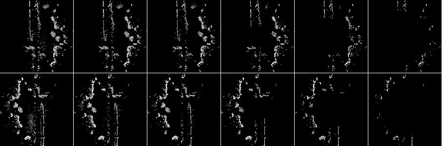
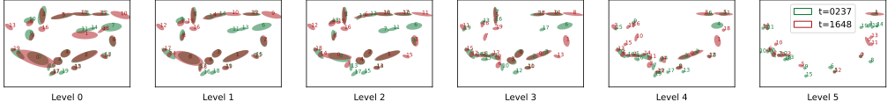

# contour-context

## Introduction
This is the official code repository of "**Contour Context: Abstract Structural Distribution for 3D LiDAR Loop Detection and Metric Pose Estimation**", which is accepted by ICRA'23.

**Contour Context** is a simple, effective, and efficient 3D LiDAR topological loop closure detector with accurate 3-DoF metric pose estimation, targeting the urban autonomous driving scenario. Our key insight is that the scene expressed in BEV can be modeled as a probability distribution of salient structures. A two-step discrete constellation consensus verification and GMM L2 optimization with continuous densities is used to calculate similarity between two scans, after preselecting loop candidates using an efficient retrieval key. Our method is competitive compared with many recent works on different datasets.

**Authors:** Binqian Jiang and Shaojie Shen from the [HKUST Aerial Robotics Group](https://uav.hkust.edu.hk/).

[preprint](https://arxiv.org/abs/2302.06149), [video](https://www.youtube.com/watch?v=BnwpP-CfI7g), [code](https://github.com/lewisjiang/contour-context)


If you find this work useful, please consider citing our paper:

```
@inproceedings{jiang2023contour,
address     = {London, United Kingdom},
title       = {Contour Context: Abstract Structural Distribution for 3D LiDAR Loop Detection and Metric Pose Estimation},
ISBN        = {9798350323658},
DOI         = {10.1109/ICRA48891.2023.10160337},
booktitle   = {2023 IEEE International Conference on Robotics and Automation (ICRA)},
author      = {Jiang, Binqian and Shen, Shaojie},
year        = {2023},
pages       = {8386–8392}
}

```


## Usage

We've tested on Ubuntu 20.04 with ROS 1. The `cont2contops` library, which contains all the required functions of *Contour Context*, is totally ROS-free.

### Dependencies
1. [Eigen 3](https://eigen.tuxfamily.org/index.php?title=Main_Page)
2. [Ceres 2](https://github.com/ceres-solver/ceres-solver)
3. [OpenCV 4](https://github.com/opencv/opencv)
4. [pcl](https://github.com/PointCloudLibrary/pcl)
5. [glog](https://github.com/google/glog)

Our project also relies on [nanoflann](https://github.com/jlblancoc/nanoflann). Note that their code has already been included in the `./thirdparty` folder after some modifications.

### On KITTI Odometry dataset
[Official site](https://www.cvlibs.net/datasets/kitti/eval_odometry.php). Note that we use GT poses from [Semantic KITTI](http://www.semantic-kitti.org/dataset.html).

#### Procedure

1. Download and unzip the dataset. Put the poses files in place as Semantic KITTI.
2. Download and compile code:
   1. `cd /path/to/catkin_ws/src `
   2. `git clone https://github.com/lewisjiang/contour-context.git`
   3. `cd .. && catkin build cont2 && source devel/setup.bash`
3. (Once for a sequence) In `./scripts/gen_batch_bin_configs.py`, 
   1. Uncomment a sequence and modify the path parameters in `== KITTI Odometry ==` section (`== Mulran Odometry ==` for MulRan) following the commented examples.
   2. Uncomment `gen_kitti(dir_lid_bin, fp_pose, fp_times, fp_calib, sav_1, sav_2)`  (`gen_mulran(...)` for MulRan) and run the script.
4. In  `./config/batch_bin_test_config.yaml`, 
   1. Set the `fpath_sens_gt_pose` and `fpath_lidar_bins` parameters as `sav_1` and `sav_2` respectively. 
   2. Set  the `fpath_outcome_sav` in the file as you like.
   3. (For MulRan) Modify the settings `ta_h_bar`, `lv_grads_`  in as instructed in the config file.
5. `rosrun cont2 cont2_batch_bin_test`
6. Terminate the program and you will find the runtime log in `./log` and topological loop detection and mpe results in `./results/outcome_txt`.
7. Modify the file paths for gt sensor poses and outcome in `./scripts/pr_mpe.py` before running the script to get pr curve, max f1 score and metric pose estimation of a given sequence. 
   1. (For MulRan) Finish the additional steps first.


### On MulRan dataset

[Official site](https://sites.google.com/view/mulran-pr/dataset)

#### Procedure

Similar to above.

#### Additional steps 

Our system uses time gap to exclude past poses from the query candidates, so it may be problematic since the vehicle always stops at red lights in MulRan. Therefore we reindex the frames in MulRan to skip stationary times. To do this, 

1. Finish the above 1-6.
2. In `./include/cont2/evaluator.h` ,
   1. Uncomment `// save gt pose and bin path ` section  and recompile.
   2. `rosrun cont2 cont2_batch_bin_test` once to generate new `ts-sens_pose-` (for config `fpath_sens_gt_pose`) and `ts-lidar_bins`  (for config `fpath_lidar_bins`) files.
   3. Save the two new files and use them in the configuration yaml.
   4. Comment `// save gt pose and bin path ` section and recompile.

3. Run normally.

### Visualization

#### Loop connections

Make sure the `PUB_ROS_MSG` flag is set to `1` in the cmakelists file.

```bash
cd /path/to/catkin_ws
rviz -d ./src/contour-context/config/dummy_lc.rviz & rosrun cont2 cont2_batch_bin_test
```

Sample image (KITTI08 at max f1 score):


#### Raw contours

Set `SAVE_MID_FILE` to `1`  in the cmakelists to save raw contours as images on the go.

Sample raw contours (KITTI 08, #0237 and #1648):



#### Ellipses of contours

In `./scripts/plot_contours.py`, ...

Sample CAs from a pair of loop closure scans (transform applied, KITTI 08, #0237 and #1648):



## Misc

